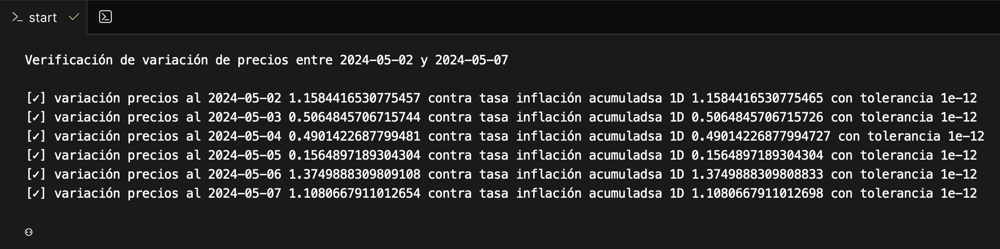
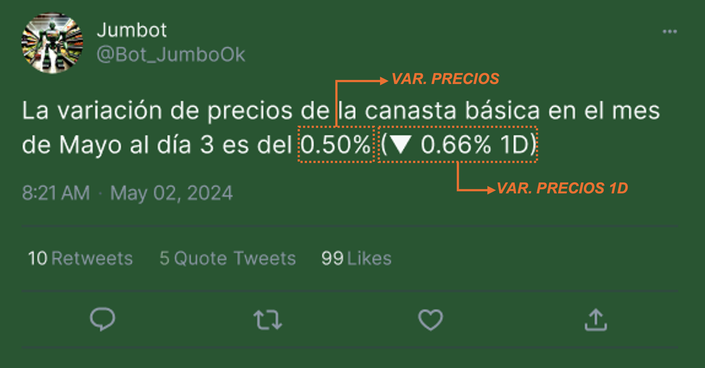

<div align="center">
   
</div>

# Verificador de variación de precios de [Jumb⚇‪t](https://x.com/Bot_JumboOk)

[Jumb⚇‪t](https://x.com/Bot_JumboOk) es un bot que publica diariamente a sus seguidores la variación de precios de la canasta básica alimentaria para un conocido Hiper.

Durante la ejecución del proceso va a realizar la verificación de consistencia de datos. Esta compara `variación de precio` contra `tasa de inflación acumulada 1D`.



### Para qué sí sirve?

 - Si alguno de estos datos estuviera mal calculado o cargado, la verificación logra interrumpir la ejecución sin permitir que se publiquen datos inválidos.

### Para qué no sirve?

- No previene que se puedan alterar los datos de las muestras base.

# Ejecutar

## En la nube

1. Ir a [codesandbox.io](https://codesandbox.io/p/github/jumbotok/verificador_variaciones/main)

## Localmente

1. Requiere python 3.9 o superior

1. Instalar los requirimientos

   ```bash
   pip install -r requirements.txt
   ```

1. Ejecutar la runtina de verificación

   ```bash
   python3 main.py
   ```

# Metodología



## Introducción

[Jumb⚇‪t](https://x.com/Bot_JumboOk) a diario obtiene precios publicados pertencientes a la Canasta Básica Alimentaria de Argentina para realizar los cálculos de variación de precios. Actualmente no busca ponderar. Además, del cálculo día a día tiene cortes semanales y mensuales.

La lista de categoría de productos se puede encontrar en [Metodología INDEC No 22](https://www.indec.gob.ar/ftp/cuadros/sociedad/EPH_metodologia_22_pobreza.pdf).

## Forma de calcular

▪ variación de precios (1-1, 1-2, ..., 1-31). Más o menos que se paga la compra el día X de mes vs 1ero de mes. El 1-1, da 0% pq se compara contra el mismo, "no varía".

▪ variación de precios 1D. Más o menos que se paga la compra de hoy vs ayer. Permite verificar.

## Ejemplo de datos

| fecha      | variación precio   | variación precio 1D | publicación                                                          |
|------------|--------------------|---------------------|----------------------------------------------------------------------|
| 2024-05-01 | 0.00               | 1.1542629190877136  | No disponible. Los 1ero de mes [porque es cero](#forma-de-calcular)  |
| 2024-05-02 | 1.1584416530775457 | 1.1584416530775457  | [Ver](https://x.com/Bot_JumboOk/status/1785992611662049548)          |
| 2024-05-03 | 0.5064845706715744 | -0.6444910298656623 | [Ver](https://x.com/Bot_JumboOk/status/1786355086035390491)          |
| 2024-05-04 | 0.4901422687799481 | -0.0162599477649934 | [Ver](https://x.com/Bot_JumboOk/status/1786717290911969678)          |
| 2024-05-05 | 0.1564897189304304 | -0.3320251542256756 | [Ver](https://x.com/Bot_JumboOk/status/1787079722893230249)          |
| 2024-05-06 | 1.3749888309809108 | 1.2165952655388992  | [Ver](https://x.com/Bot_JumboOk/status/1787442348823105626)          |
| 2024-05-07 | 1.1080667911012654 | -0.2633016713073601 | [Ver](https://x.com/Bot_JumboOk/status/1787805133499240675)          |
| 2024-05-08 | 1.074701536116322  | -0.0329995974049097 | [Ver](https://x.com/Bot_JumboOk/status/1788167556794081325)          |
| 2024-05-09 | 1.512453681518906  | 0.4330976384294871  | [Ver](https://x.com/Bot_JumboOk/status/1788529517839212748)          |

> Ver [lista de precios](data/precios.md) en base a los cuales se realizan los cálculos de variaciones. Para conocer fórmulas de cálculo, ver la sección [forma de calcular](#forma-de-calcular).

## Forma de validar cálculo

▪ verificar, la tasa de inflación acumulada usando variación de precios 1D, equivale a la variación de precio el mismo periodo.

  ```output
  variación de precios(1-15) = tasa acumulada para variaciones 1D (1, 2, ...,15).
  ```

# Contribuciones

No hay guía de momento pero son bienvenidos todos los comentarios, defectos o cambios.

### ⚇
